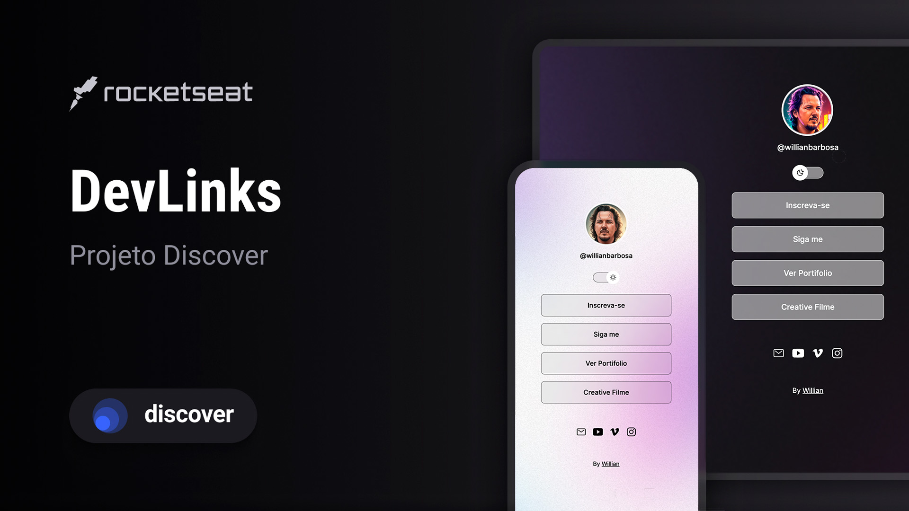

<h1 align="center"> DevLinks </h1>

Trabalho desenvolvido durante o curso promovido pela Rocketseat 

  <a href="#-tecnologias">Tecnologias</a>&nbsp;&nbsp;&nbsp;|&nbsp;&nbsp;&nbsp;
  <a href="#-projeto">Projeto</a>&nbsp;&nbsp;&nbsp;|&nbsp;&nbsp;&nbsp;
  <a href="#-layout">Layout</a>&nbsp;&nbsp;&nbsp;|&nbsp;&nbsp;&nbsp;
  <a href="#memo-licença">Licença</a>

  

 

  

## 🚀  Tecnologias

Esse projeto foi desenvolvido com as seguintes tecnologias:

- HTML e CSS
- JavaScript
- Figma
- Git e Github

## 💻  Projeto

Este projeto foi pensado e desenvolvido como forma de apresentar o desempenho durante o Curso Discover. Como meu primeiro trabalho, tenho orgulho de dizer que estou me desenvolvendo em tecnologias que me desafiam a aprender todos os dias.

## 🔖  Layout

Você pode visualizar o layout do projeto através [DESSE LINK](https://www.figma.com/file/J1Z33MISC22YZB8wfxiIns/NLW-Copa-Explorer/duplicate). É necessário ter conta no [Figma](https://figma.com) para acessá-lo.

## 📝  Licença

Esse projeto está sob a licença MIT.

---

By Willian Andrade and Rocketseat 
